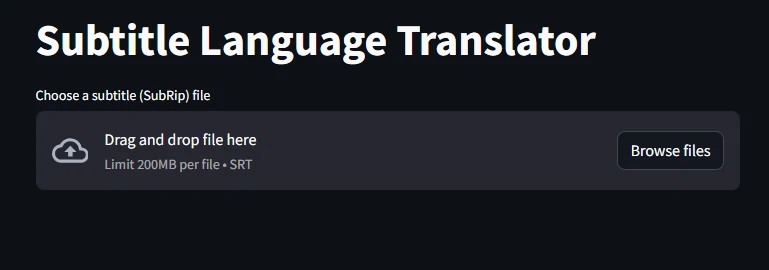
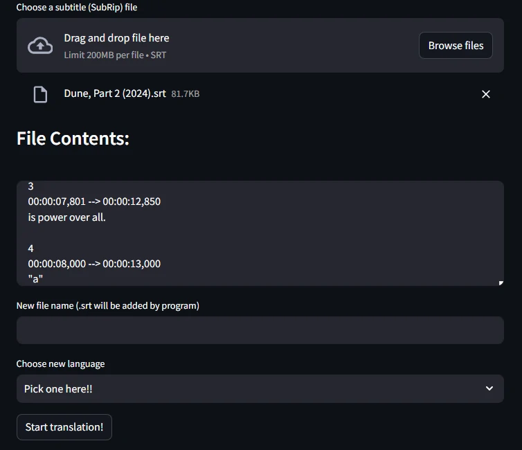
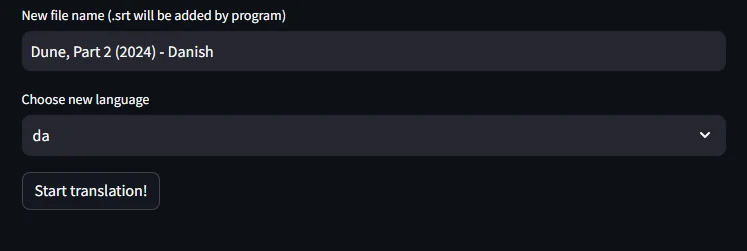
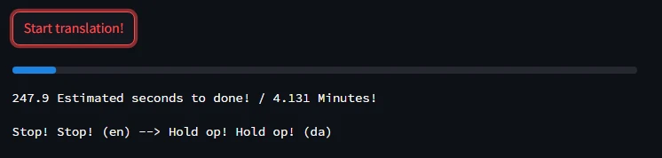
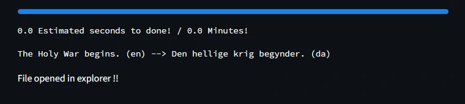
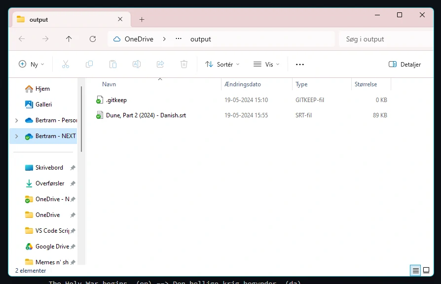

#  **Subtitle Language Translation (SLT)**

>  **Note**  
>  If you're using any other OS than windows this will probaly not work, because it is depending on the python libary **os** which is made for windows only, [see this doc for more info](https://docs.python.org/3/library/os.html)

##  **Key Features**

*  Automatic origin language finder

*  Easy use with the use of the [Streamlit](https://streamlit.io/) library to UI
  
*  Timestamps and other key information like formatting will be kept in the SubRip (.srt) file

*  Loading bar showing the progress of translated files
   *  With text that shows an estimate of time to run the task
  
*  Choose from a variety of languages (With the ability to add customs as well)


  
  

##  **Installation and setup**

  

To clone and run this application, you'll need [Git](https://git-scm.com) and [Python 3.11.9](https://www.python.org/downloads/?ref=gfxhacks.com) many other python version should work as well, but 3.11.9 was used for the creation of the script.

  

From your command line:

```bash
# Clone this repository
git clone https://github.com/BertramAakjaer/Python_duplicate_file_checker.git

# Install streamlit library
pip install streamlit

# Install googletrans libary
pip3 install googletrans==3.1.0a0

# Enter the directory
cd Subtitle-Language-Translator-SLT/

# Run the script using streamlit and it should open in your default browser
python -m streamlit run main.py
```

##  **Usage**



**1.** Firstly press the button *Browse files* and choose the subtitle (SubRip) file that is going to be translated.



**2.** Now you can go ahead and check if its the right file thats been choosen, if thats the case you can simply enter a new name, destination language and press *Start translation!*.



**3.** Now the .srt file will be translated and you can sit back and relax in the estimated time period, tha u can read under the button.



**4.** After the process finishes it will open the windows file-explorer in the output directory where the file has been written to.



##  **License**
This project is licensed under the [GNU V3 License](LICENSE).

  
  

##  **Socials**

>  [aakjaer.site](https://www.aakjaer.site) &nbsp;&middot;&nbsp;
>  GitHub [@BertramAakjær](https://github.com/BertramAakjaer) &nbsp;&middot;&nbsp;
>  Twitter [@BertramAakjær](https://twitter.com/BertramAakjaer)
